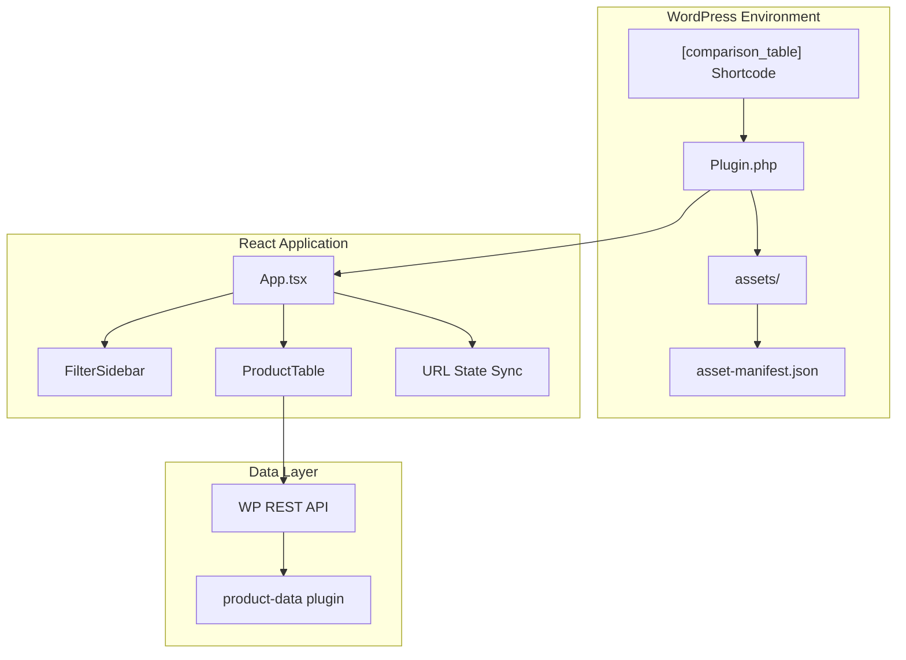
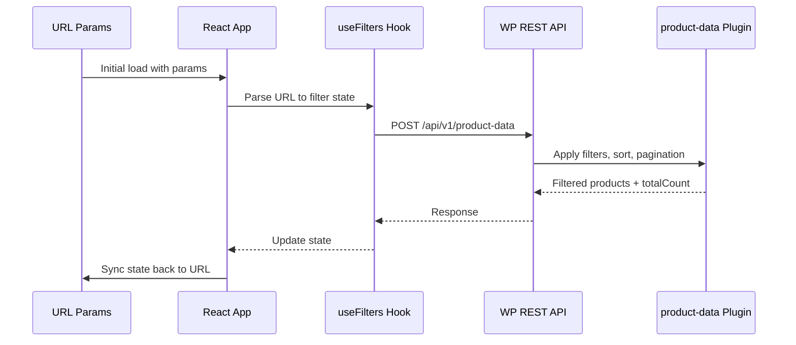

# Comparison Experience Plugin - Technical Design

## 1. Overview

A React application embedded in WordPress that displays health insurance products in a vertical table format with collapsible detail sections (Extras, Hospital, Ambulance) and a filter sidebar. Filters sync to URL for shareable links.

**Scope Exclusions:**

- Quiz flow (to be added later)
- Compare checkbox functionality
- Promoted badge logic

---

## 2. Architecture



---

## 3. Directory Structure

```
comparison-experience/
├── comparison-experience.php          # Main plugin file
├── src/
│   ├── Plugin.php                     # PHP plugin class (existing)
│   ├── Admin/SettingsPage.php         # Admin settings (existing)
│   ├── Shortcode/
│   │   └── TableShortcode.php         # [comparison_table] shortcode handler
│   └── Assets/
│       └── AssetLoader.php            # Loads React assets from manifest
├── app/                               # React application
│   ├── package.json                   # Uses yarn (yarn.lock)
│   ├── yarn.lock
│   ├── vite.config.ts
│   ├── tsconfig.json
│   ├── index.html                     # Dev entry point
│   ├── src/
│   │   ├── main.tsx                   # React entry point
│   │   ├── App.tsx                    # Root component
│   │   ├── components/
│   │   │   ├── ProductTable/
│   │   │   │   ├── ProductTable.tsx
│   │   │   │   ├── ProductCard.tsx
│   │   │   │   ├── DetailSection.tsx
│   │   │   │   ├── AttributeRow.tsx
│   │   │   │   └── index.ts
│   │   │   ├── Filters/
│   │   │   │   ├── FilterSidebar.tsx
│   │   │   │   ├── FilterGroup.tsx
│   │   │   │   ├── RadioFilter.tsx
│   │   │   │   ├── CheckboxFilter.tsx
│   │   │   │   ├── MultiSelectFilter.tsx
│   │   │   │   ├── MobileFilterDrawer.tsx
│   │   │   │   └── index.ts
│   │   │   └── common/
│   │   │       ├── Badge.tsx
│   │   │       ├── Button.tsx
│   │   │       ├── Spinner.tsx
│   │   │       └── index.ts
│   │   ├── hooks/
│   │   │   ├── useProducts.ts         # API fetching + caching
│   │   │   ├── useFilters.ts          # Filter state management
│   │   │   └── useUrlSync.ts          # URL <-> state sync
│   │   ├── services/
│   │   │   └── api.ts                 # API client
│   │   ├── types/
│   │   │   ├── product.ts
│   │   │   └── filters.ts
│   │   ├── utils/
│   │   │   └── filterMapping.ts       # URL params <-> API filters
│   │   └── styles/
│   │       └── index.css              # Tailwind entry
│   └── dist/                          # Production build output
├── assets/                            # WP-served production assets
│   └── asset-manifest.json
└── TECH_DESIGN.md
```

---

## 4. Data Flow



---

## 5. API Contract

**Endpoint:** `POST /wp-json/api/v1/product-data`

See [product-data README](../product-data/README.md) for full API documentation.

**Request Example** (user selects: Bupa + HBF providers, Bronze hospital cover, General dental + Optical extras):

```json
{
  "filters": [
    { "field": "providerName", "comparator": "eq", "value": ["Bupa", "HBF"] },
    { "field": "hospitalCover", "comparator": "like", "value": "Bronze" },
    { "field": "extrasTreatments", "comparator": "contains", "value": "General dental" },
    { "field": "extrasTreatments", "comparator": "contains", "value": "Optical" }
  ],
  "sort": [
    { "field": "metadata.basePrice", "direction": "ASCENDING" }
  ],
  "pagination": {
    "offset": 0,
    "pageSize": 20
  }
}
```

**Filter Rules:**

- Multiple filters combine with AND logic
- For multi-select (treatments), add one filter object per selected value
- Exception: `providerName` accepts array value for OR logic within providers

**Supported Filters:**

| Field | Comparator | Value | Description |
|-------|------------|-------|-------------|
| `providerName` | `eq` | `string[]` | Provider names (OR logic) |
| `coverType` | `contains` | `"Hospital"` \| `"Extras"` \| `"Combined"` | Filter by cover type |
| `hospitalCover` | `like` | `"Basic"` \| `"Bronze"` \| `"Silver"` \| `"Gold"` | Hospital tier |
| `hospitalTreatments` | `contains` | `string` | Treatment name (one filter per treatment) |
| `extrasTreatments` | `contains` | `string` | Treatment name (one filter per treatment) |

**Response:**

```json
{
  "products": [...],
  "totalCount": 150,
  "offset": 0,
  "pageSize": 20
}
```

---

## 6. Filter Specifications

| Filter | UI Type | URL Param | API Field | Comparator |
|--------|---------|-----------|-----------|------------|
| Provider | Multi-select + search | `providers` | `providerName` | `eq` (array) |
| Cover Type | Radio | `coverType` | `coverType` | `contains` |
| Hospital Cover | Checkbox | `hospitalCover` | `hospitalCover` | `like` |
| Extras Treatments | Multi-select dropdown | `extras` | `extrasTreatments` | `contains` |
| Hospital Treatments | Multi-select dropdown | `hospitalTreatments` | `hospitalTreatments` | `contains` |

**Filter Behavior:**

- Apply immediately on change (no Apply button)
- AND logic between different filter groups
- For multi-select filters (treatments), each selected value becomes a separate filter object
- Exception: `providerName` uses OR logic within the array value

---

## 7. Component Specifications

### 7.1 ProductCard

Maps to screenshot `vertical-table-collapsed.png`:

- Checkbox (Compare - disabled for MVP)
- PROMOTED badge (if applicable)
- Provider logo (`productImage`)
- Product name (`productName`)
- Badges row (`badges[]`)
- Price block (`metadata.basePrice`)
- CTA button ("GO TO SITE" -> `redirectUrl`)
- Description with info icon (`description`)
- Collapsible detail sections (`details[]`)

### 7.2 DetailSection

Three types based on `details[].title`:

- **Extras** - Shows treatments with availability icons and metadata
- **Hospital** - Shows tier info, excess, accommodation, treatments
- **Ambulance** - Simple available/unavailable indicator

### 7.3 FilterSidebar

Desktop: Fixed sidebar on left

Mobile: Slide-out drawer (triggered by filter button)

---

## 8. Build Configuration

### 8.1 Development Mode

```bash
cd app && yarn dev
```

- Vite dev server with HMR
- API proxy to `playground.finder.dev`
- Standalone index.html for development

**vite.config.ts key settings:**

```typescript
export default defineConfig({
  server: {
    proxy: {
      '/wp-json': 'https://playground.finder.dev'
    }
  },
  build: {
    manifest: true,
    outDir: '../assets',
    rollupOptions: {
      input: 'src/main.tsx'
    }
  }
})
```

### 8.2 Production Mode

```bash
cd app && yarn build
```

- Outputs to `assets/` folder
- Generates `asset-manifest.json`
- WordPress loads via `AssetLoader.php`

---

## 9. WordPress Integration

### 9.1 Shortcode

```php
[comparison_table]
```

Renders a container div with data attributes:

```html
<div id="comparison-table-root" 
     data-api-base="<?php echo rest_url('api/v1'); ?>">
</div>
```

### 9.2 Asset Loading

`AssetLoader.php` reads `asset-manifest.json` and enqueues:

- Main JS bundle
- CSS file
- Passes `comparisonTableSettings` via `wp_localize_script`

---

## 10. State Management

Using React hooks + URL as source of truth:

```typescript
// useFilters.ts - manages filter state
const [filters, setFilters] = useUrlState({
  providers: [],
  coverType: 'any',
  hospitalCover: [],
  extras: [],
  hospital: []
});

// useProducts.ts - fetches data when filters change
const { products, isLoading, error } = useProducts(filters);
```

---

## 11. Responsive Behavior

| Breakpoint | Table | Filters |
|------------|-------|---------|
| Desktop (>1024px) | Horizontal scroll carousel | Left sidebar |
| Tablet (768-1024px) | Horizontal scroll | Collapsible top section |
| Mobile (<768px) | Single card view | Slide-out drawer |

---

## 12. Error & Loading States

- **Loading:** Skeleton cards while fetching
- **Error:** "Unable to load products" with retry button
- **Empty:** "No products match your criteria" with reset filters link
